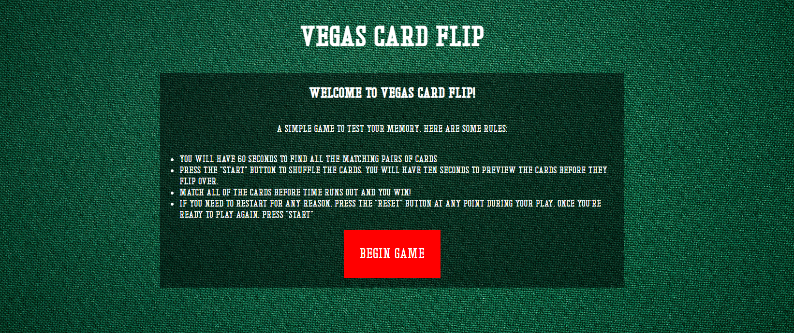
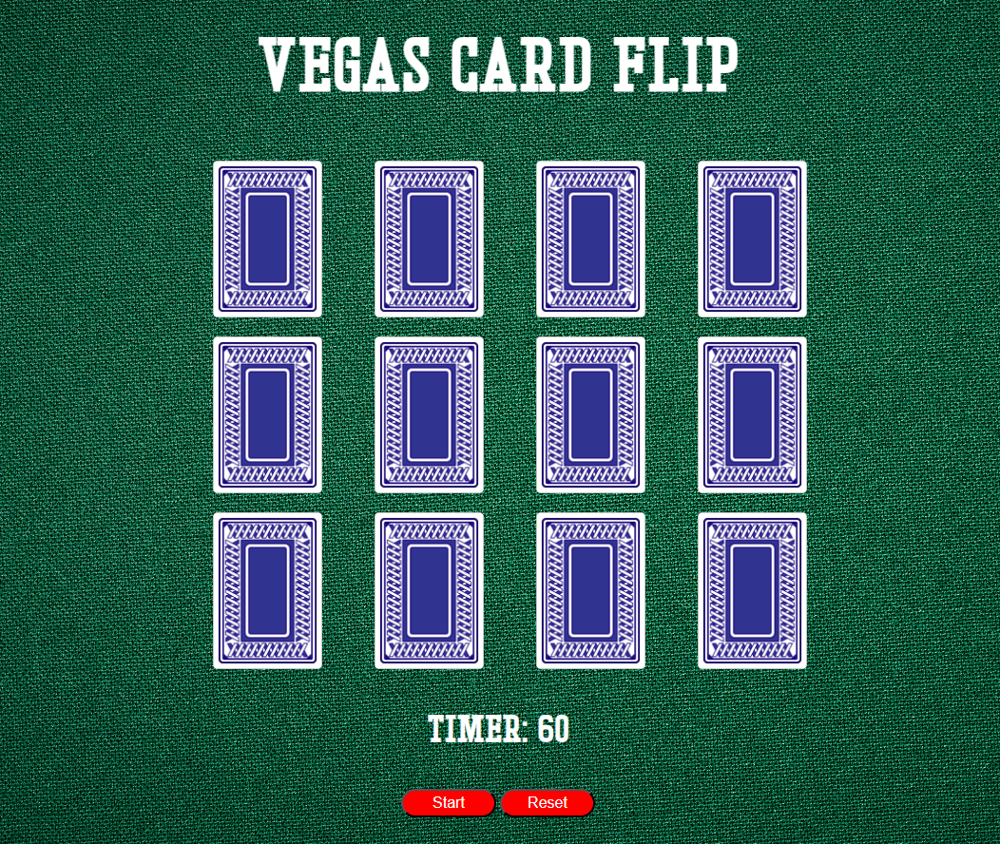
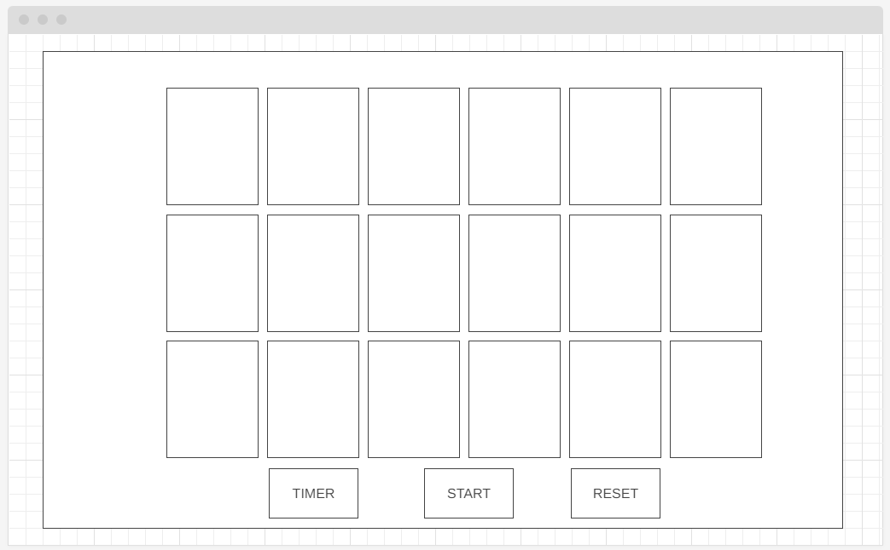

# Vegas Card Flip (Memory Game)

#### A browser-based memory game created as my first project.

## Description
My browser-based game, "Vegas Card Flip," is a project I created to show my knowledge of vanilla JavaScript, HTML, and CSS. It is a memory game that requires the player to match multiple pairs of cards within a set time limit.

## Table of Contents
* [Technologies Used](#technologiesused)
* [Design](#design)
* [Functionality](#functionality)
* [Project Next Steps](#nextsteps)
* [Deployed App](#deployment)
* [About the Author](#author)

## Technologies Used
* JavaScript
* HTML5
* CSS3

## Whiteboard Images
*Original wireframe layout

## Trello Planning
* All planning done in Trello

## Design
* Design elements implemented using HTML5 and CSS3. 

## Functionality
* Creates a shuffled set of cards
* Takes shuffled cards and creates a new game board
* Will check for card matches as player clicks on two cards
* Cards will remain flipped or flip back over depending on if they are matches
* Checks for wins throughout the game; once player matches all cards they will get a "win" message
* Player is able to reset/restart the game at any time while playing

## Project Next Steps
* Users will be able to choose different difficulties
* Users wil be able to change the game mode from being timed to limiting move counts

## Deployed Link
[Vegas Card Flip](https://mherrera491.github.io/ConcentrationGame/)

* You can view the repository:
[Github.com](https://github.com/mherrera491/ConcentrationGame)
* If unable to view please go live locally through VS Code
    
## Works Cited:
* N/A

## About The Author
I am a software engineer who excels at analyzing problems and coming up with creative and effective solutions. As a team leader or an independent worker I believe in collaborating to break down intricate problems to come up with effective solutions. I can build a website, fix code, and help brands improve their overall business.